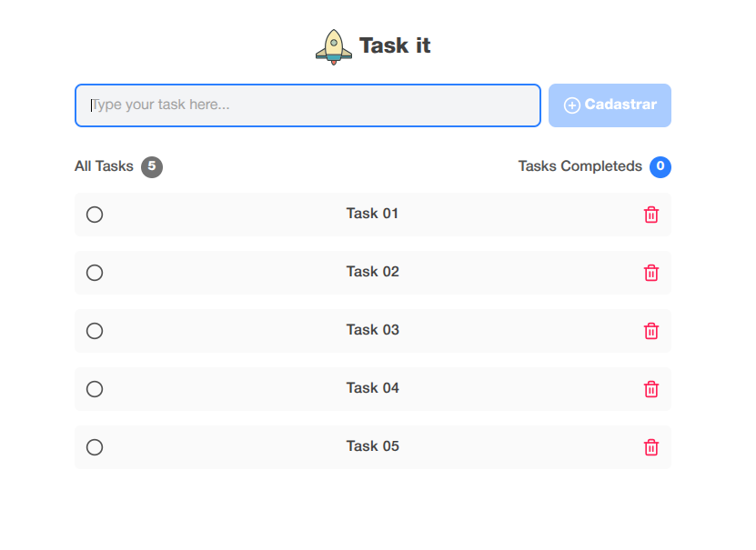

# Task-it 📋 - App de Tarefas com Vue.js

Uma aplicação simples e eficiente de gerenciamento de tarefas desenvolvida com **Vue.js 3**, **Pinia**, **Tailwind CSS** e **TypeScript**. Este projeto representa a **fase 1** da minha jornada de aprendizado no ecossistema Vue, inspirada na estrutura do primeiro módulo do curso da Rocketseat sobre React.

---

## 🚀 Tecnologias Utilizadas

- [Vue.js 3](https://vuejs.org/)
- [Vite](https://vitejs.dev/)
- [Pinia](https://pinia.vuejs.org/)
- [Tailwind CSS](https://tailwindcss.com/)
- [TypeScript](https://www.typescriptlang.org/)
- [Vitest](http://vitest.dev/)
- [Cypress](https://www.cypress.io/)
- [Vue Test Utils](https://test-utils.vuejs.org/)

---

## ✅ Funcionalidades Implementadas

1. ✅ **Visualizar tarefas**
2. ✅ **Criar nova tarefa**
3. ✅ **Remover tarefa**
4. ✅ **Estados globais com Pinia**
5. ✅ **Gerenciamento de estado reativo**
6. ✅ **Integração com TypeScript**
7. ✅ **Composables personalizados**
8. ✅ **Props entre componentes**
9. ✅ **Imutabilidade no estado**
10. ✅ **Reatividade com `ref` e `computed`**
11. ✅ **Composition API como base da arquitetura**
12. ✅ **Persistência com localStorage**

---

## 💡 Funcionalidades Futuras (não obrigatórias)

- [ ] **Remover múltiplas tarefas ao mesmo tempo**
- [ ] **Marcar todas como concluídas**
- [ ] **Edição de tarefas**
- [ ] **Filtros por status (Todas / Ativas / Concluídas)**

---

## 📁 Estrutura de Pastas

```

src/
├── components/
│ ├── header.vue
│ ├── task-item.vue
  │ ├── completed-task-button.vue
  │ ├── task-item.vue
  │ ├── delete-task-button.vue
│ ├── new-task-form.vue
│ └── summary.vue
├── composables/
│ └── useTaskStatus.ts
├── libs/
│ └── pinia.ts
├── stores/
│ └── tasks.ts
├── types/
│ └── tasks.ts
├── app.vue
└── main.ts

```

---

## 🧠 Conceitos Trabalhados

- Componentização com Single File Components (SFC)
- Passagem de dados com `defineProps`
- Controle de estado com `ref`, `computed` e `reactive`
- Composição de lógica com `setup()` e `composables`
- Estilização utilitária com Tailwind
- Estrutura modular para escalabilidade
- Tipagem e boas práticas com TypeScript

---

## 📸 Preview



---

## ✨ Considerações

Este projeto marca o início de uma nova trilha de conhecimento no universo Vue.js. A ideia é dominar o framework com a mesma profundidade com que aprendi React, seguindo os mesmos valores: clareza, escalabilidade e código limpo.

---

## 📜 Licença

Este projeto está sob a licença MIT.

---

> Feito com dedicação por Gabriel Corto Francisco 🌱
